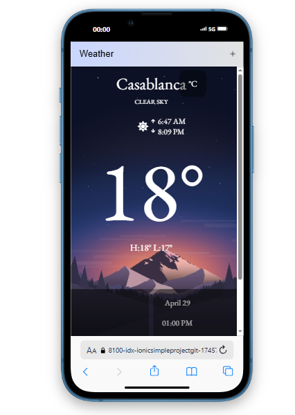

# Ionic Weather App ☀️🌧️

A simple cross-platform mobile app built with the **Ionic Framework** to display current weather information using a third-party weather API.

---

## 📋 Table of Contents

- [Description](#description)
- [Features](#features)
- [Screenshots](#screenshots)
- [Getting Started](#getting-started)
- [Installation](#installation)
- [Dependencies](#dependencies)
- [License](#license)

---

## 📖 Description

This project leverages **Ionic** to build a lightweight, responsive mobile application. It fetches real-time weather data from an external API and presents it through a user-friendly interface designed for ease of use across various devices.

---

## ✨ Features

- Display current weather conditions based on location or input.
- Integration with a reliable external **Weather API**.
- Responsive design suitable for Android, iOS, and Web platforms.
- Clean and intuitive user interface.
- Easy setup and lightweight codebase for faster builds.

---

## 📷 Screenshots

You can find application screenshots in the `src/assets/images/` directory.

| Home | Home1 | Settings | Forecast |
| ---- | ------- | -------- | -------- |
|  |  |  |  |

---

## 🚀 Getting Started

Follow these instructions to set up and run the project locally.

### Prerequisites

- [Node.js](https://nodejs.org/) (v16 or later recommended)
- [Ionic CLI](https://ionicframework.com/docs/cli) installed globally:
  ```bash
  npm install -g @ionic/cli
  ```

---

## 🛠 Installation

1. **Clone the repository:**

   ```bash
   git clone <repository-url>
   ```

2. **Navigate to the project directory:**

   ```bash
   cd <project-directory>
   ```

3. **Install dependencies:**

   ```bash
   npm install
   ```

4. **Run the application in development mode:**

   ```bash
   ionic serve
   ```

---

## 📦 Dependencies

- [Ionic Framework](https://ionicframework.com/)
- External **Weather API** (e.g., OpenWeatherMap, WeatherAPI)

---

## 📄 License

This project is licensed under the [MIT License](LICENSE).

---

## Made by Youssef Ouben Said - GLSID2

---

